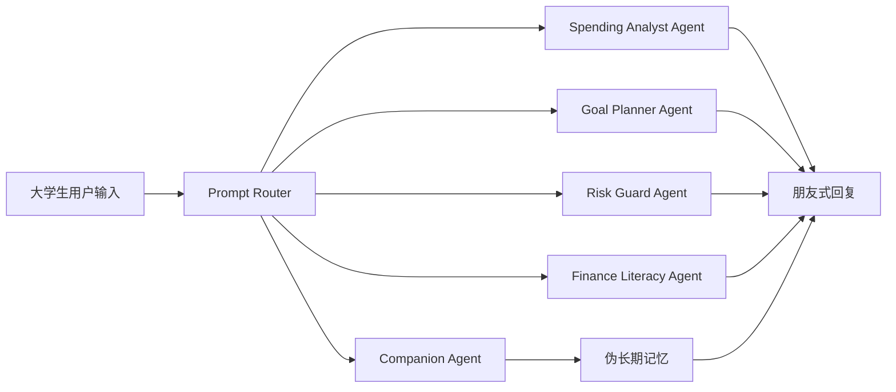

# CashBuddy Architecture

## 说明

CashBuddy 对外聚焦 3 个核心能力，内部使用轻量 Prompt Routing 模拟 Multi-Agent 架构：

- 消费分析与现金流诊断
- 攒钱目标规划
- 消费与理财风险守护

- `Companion Agent`：统一语气、陪伴感、长期记忆感
- `Spending Analyst Agent`：消费结构分析与风险识别
- `Goal Planner Agent`：攒钱周期拆解与预算建议
- `Risk Guard Agent`：冲动消费识别、冷静期和替代方案
- `Finance Literacy Agent`：应急储蓄、风险认知、反跟风和入门理财教育

模型层按赛题要求接入 DeepSeek API；无 API Key 时自动降级为本地规则回复，保证现场 Demo 稳定。

比赛演示时强调：Demo 优先体现产品完成度、Agent 感和银行场景下的金融素养教育，不追求金融级复杂计算。
