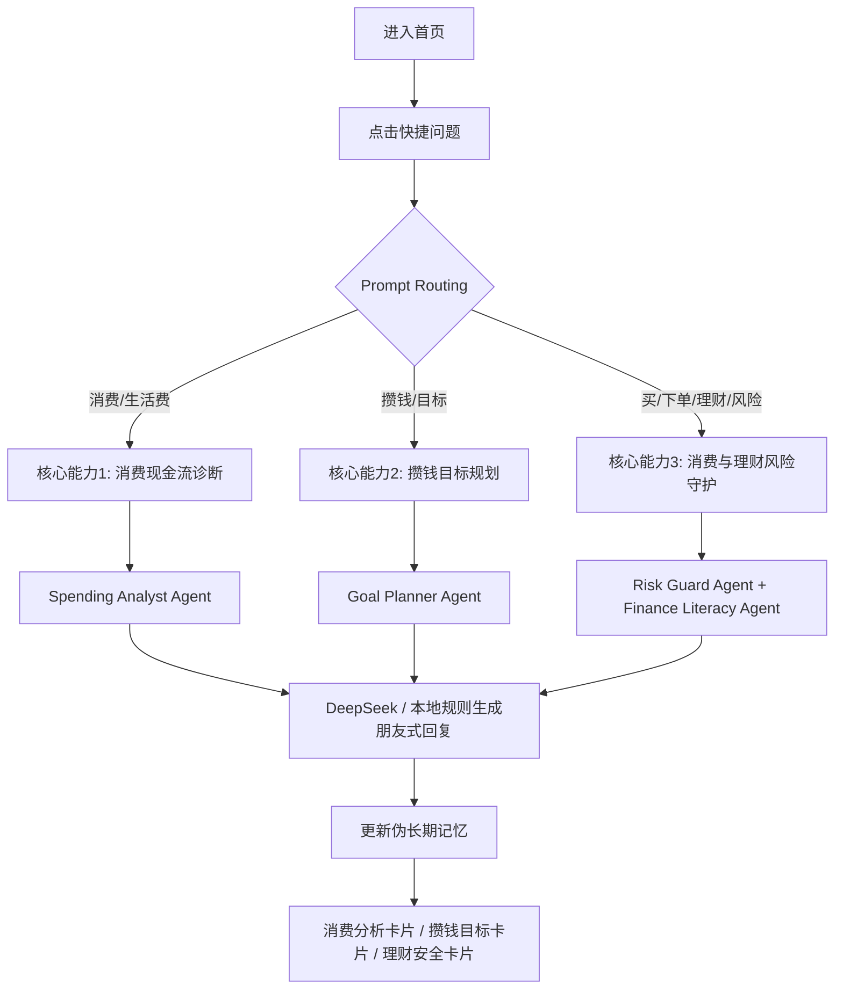

# CashBuddy Demo Flow

```mermaid
flowchart TD
    A[进入首页] --> B[点击快捷问题]
    B --> C{Prompt Routing}
    C -->|消费/生活费| D[核心能力1: 消费现金流诊断]
    C -->|攒钱/目标| E[核心能力2: 攒钱目标规划]
    C -->|买/下单/理财/风险| F[核心能力3: 消费与理财风险守护]
    D --> D1[Spending Analyst Agent]
    E --> E1[Goal Planner Agent]
    F --> F1[Risk Guard Agent + Finance Literacy Agent]
    D1 --> G[DeepSeek / 本地规则生成朋友式回复]
    E1 --> G
    F1 --> G
    G --> H[更新伪长期记忆]
    H --> I[消费分析卡片 / 攒钱目标卡片 / 理财安全卡片]
```
